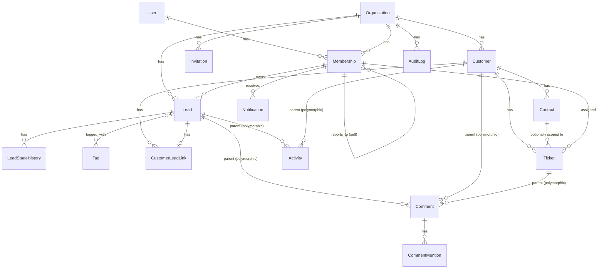

# 03 — Domain Model

**Relation to 01/02:** This document translates 01-product-requirements.md
and 02-business-rules.md into concrete entities, their attributes, and
the relationships between them — the direct input for 04-erd.md. It is
still conceptual (no column types, no index/constraint syntax yet);
that belongs in the ERD.

**Modeling conventions used throughout:**
- Every tenant-scoped entity implicitly has `organization_id`
  (Business Rules 1.1) — not repeated in every entity below to avoid
  clutter, but assumed unless marked *(global)*.
- Every entity implicitly has `created_at`, and `deleted_at`
  (nullable, soft-delete per Business Rules 12.1) unless marked
  *(no soft-delete)* — a handful of pure history/log entities are
  intentionally append-only and never soft-deleted, since deleting a
  log entry would defeat its purpose.
- Role lives on **Membership**, not on **User** — confirmed by
  Business Rules 1.3 (a user can belong to multiple organizations
  with a different role in each).

---

## 1. One Naming Decision Worth Flagging: "Notes" = "Comments"

The PRD lists **Notes** as a Lead feature (5.4) and a Customer feature
(5.6), **Internal notes** as a Ticket feature (5.8), and **Comments**
(with @mention) as a separate Collaboration feature (5.9). Business
Rules 9.1 already decided Comments attach to Lead, Customer, and
Ticket — the same three entities "Notes"/"Internal notes" were
attached to.

**Decision: these are the same underlying entity, not two separate
systems.** Building a `Note` model and a near-identical `Comment`
model side by side would recreate exactly the kind of duplicate-
logging problem already avoided once for Timeline vs. Audit Log
(PRD 8.1). A single `Comment` entity (Section 4 below) covers all of
it: a "Note" is simply a Comment without any `@mention` in the body,
and a Ticket's "Internal note" is simply a Comment on a Ticket — there
is no customer-facing portal in this product (Public API and any
customer self-service view are Out of Scope, PRD Section 6), so every
Ticket comment is inherently internal already. This does not change
any behavior described in the PRD; it just avoids building two tables
that would do the same job.

---

## 2. Entity: User *(global, not tenant-scoped)*

Represents a login identity, independent of any organization.

| Field | Notes |
|---|---|
| id | |
| email | globally unique |
| password_hash | |
| is_email_verified | gates write actions per Business Rules 2.4 |
| created_at | |

**Relationships:** one User → many Memberships (one per Organization,
Business Rules 1.3).

---

## 3. Entity: Organization *(global)*

| Field | Notes |
|---|---|
| id | |
| name | |
| settings | workspace settings, PRD 5.2 — kept as a loose JSON/settings blob at this modeling level; exact fields belong in the ERD once workspace-setting features are enumerated |
| deleted_at | soft-delete cascades to all child resources (Business Rules 1.4) |

**Relationships:** one Organization → many Memberships, Leads,
Customers, Tickets, etc. (everything tenant-scoped).

---

## 4. Entity: Membership

The join between User and Organization; **this is where Role lives**.

| Field | Notes |
|---|---|
| id | |
| user_id | FK → User |
| organization_id | FK → Organization |
| role | enum: Owner / Admin / Sales Manager / Sales Agent / Support Agent / Viewer (PRD Section 4) |
| reports_to | FK → Membership (nullable, self-referencing, same org) — implements "team" per Business Rules 3.2, flat one level |
| is_active | membership can be deactivated without deleting the User globally |

**Constraint:** unique on `(user_id, organization_id)` — a user has
exactly one Membership per Organization.

**Relationships:** a Membership is the `owner`/`assignee`/`author`/
`actor` on nearly every other entity below (Lead.owner, Ticket.
assignee, Comment.author, AuditLog.actor, etc.) — always referencing
Membership, never User directly, so that "who did this" is always
scoped to the correct organization context.

---

## 5. Entity: Invitation

| Field | Notes |
|---|---|
| id | |
| organization_id | FK → Organization |
| email | invitee's email (may not have a User yet) |
| role | role to grant on acceptance |
| invited_by | FK → Membership |
| token | opaque, single-use |
| status | Pending / Accepted / Expired / Revoked |
| expires_at | created_at + 7 days (Business Rules 2.5) |

**Relationships:** on acceptance, creates (or reuses, if the email
already has a User) a Membership with `is_active = true`.

---

## 6. Entity: Lead

| Field | Notes |
|---|---|
| id | |
| organization_id | |
| owner_id | FK → Membership, required (Business Rules 4.2) |
| source | |
| email | required if phone absent |
| phone | required if email absent (at least one, Business Rules 4.2) |
| stage | enum: New / Contacted / Qualified / Proposal / Negotiation / Won / Lost |
| lost_reason | required only when stage = Lost |
| is_archived | Business Rules 4.1 — independent of `stage` |
| requires_manual_customer_selection | set true on Won when multiple Customer matches found (Business Rules 5.3) |
| customer_id | FK → Customer, nullable, set on Won once resolved |

**Relationships:**
- Lead → many LeadTag → Tag (M2M, Section 7)
- Lead → many LeadStageHistory (Section 8, append-only)
- Lead → many Activity (as parent, Section 11)
- Lead → many Comment (as parent, Section 12)
- Lead → many Attachment (as parent, Section 13)
- Lead → 0 or 1 Customer (once Won)

---

## 7. Entity: Tag / LeadTag

| Entity | Fields |
|---|---|
| Tag | id, organization_id, name |
| LeadTag | id, lead_id, tag_id (M2M join) |

Simple org-scoped tag vocabulary; no further rules beyond org
isolation.

---

## 8. Entity: LeadStageHistory *(append-only, no soft-delete)*

| Field | Notes |
|---|---|
| id | |
| lead_id | FK → Lead |
| from_stage | nullable (first row on creation has no `from_stage`) |
| to_stage | |
| changed_by | FK → Membership |
| changed_at | |
| reason | required only when `to_stage = Lost` (Business Rules 5.2) |

Immutable per PRD Business Rule 4 — no update/delete operations are
ever exposed on this entity, by design, not just by convention.

---

## 9. Entity: Customer

| Field | Notes |
|---|---|
| id | |
| organization_id | |
| type | enum: Company / Individual (Business Rules 6.1) |
| name | |
| email | primary contact info if `type = Individual`; optional if `type = Company` |
| phone | same rule as email |

**Constraint:** if `type = Company`, at least one Contact (Section 10)
must exist — enforced at the service layer, since "at least one
related row must exist" isn't a standard column-level DB constraint.

**Relationships:**
- Customer → many Contact (Section 10)
- Customer → many CustomerLeadLink → many Lead (Section 9.1 below,
  history of which Won leads contributed, Business Rules 6.2)
- Customer → many Ticket (Section 14)
- Customer → many Activity (as parent)
- Customer → many Comment (as parent)
- Customer → many Attachment (as parent)

### 9.1 Entity: CustomerLeadLink

| Field | Notes |
|---|---|
| id | |
| customer_id | FK → Customer |
| lead_id | FK → Lead, unique (a Lead can only ever link to one Customer, but a Customer can have many linked Leads) |
| linked_at | |

This is what makes Business Rules 6.2 ("a Customer has a *history* of
which Leads won it business, not just a single `originating_lead_id`")
concrete — a join table rather than a single FK on Customer.

---

## 10. Entity: Contact

| Field | Notes |
|---|---|
| id | |
| customer_id | FK → Customer |
| name | |
| email | |
| phone | |

Used in Won→Customer matching (Business Rules 5.3, 6.3) alongside the
Customer's own email/phone.

---

## 11. Entity: Activity

| Field | Notes |
|---|---|
| id | |
| organization_id | |
| type | enum: Call / Meeting / Follow-up / Task / Reminder |
| parent_type | Lead / Customer (Business Rules 8.2 — exactly one required) |
| parent_id | polymorphic reference, see Section 15 |
| assignee_id | FK → Membership |
| due_date | |
| status | enum: Pending / Completed / Cancelled (Business Rules 8.1) |

---

## 12. Entity: Comment (covers "Notes" / "Internal notes", Section 1 above)

| Field | Notes |
|---|---|
| id | |
| organization_id | |
| parent_type | Lead / Customer / Ticket (Business Rules 9.1) |
| parent_id | polymorphic reference, see Section 15 |
| author_id | FK → Membership |
| body | text |

**Relationships:** Comment → many CommentMention (Section 12.1)

### 12.1 Entity: CommentMention

| Field | Notes |
|---|---|
| id | |
| comment_id | FK → Comment |
| mentioned_membership_id | FK → Membership, must be a member of the same organization (Business Rules 9.2) |

Created in Phase 2 regardless of whether Notifications (which
consumes it in Phase 3) exists yet (Business Rules 9.3).

---

## 13. Entity: Attachment

| Field | Notes |
|---|---|
| id | |
| organization_id | |
| parent_type | Lead / Customer (PRD 5.4, 5.6 — Tickets don't list Attachments in the PRD, so not included as a parent type here) |
| parent_id | polymorphic reference, see Section 15 |
| uploaded_by | FK → Membership |
| file_reference | storage key/path — exact storage backend (local vs. S3) is an Architecture Document (06) decision, not a Domain Model concern |

---

## 14. Entity: Ticket

| Field | Notes |
|---|---|
| id | |
| organization_id | |
| customer_id | FK → Customer, required (Business Rules 7.1) |
| contact_id | FK → Contact, nullable (ticket can be at the Customer level or a specific Contact) |
| subject | |
| priority | enum — exact values (e.g., Low/Medium/High/Urgent) deferred to ERD as a simple lookup, no business logic depends on the specific set |
| status | enum: Open / In Progress / Resolved / Closed / Reopened (Business Rules 7.3) |
| assignee_id | FK → Membership |
| created_by | FK → Membership |

**Relationships:** Ticket → many Comment (as parent, i.e. "Internal
notes")

---

## 15. Polymorphic Parent References (Activity, Comment, Attachment)

Three entities above (Activity, Comment, Attachment) attach to more
than one possible parent type. **Decision: model this using Django's
built-in `GenericForeignKey` (ContentType framework)** rather than
three nullable FK columns per table (`lead_id`, `customer_id`,
`ticket_id`, mostly-null). This is the standard, idiomatic Django
pattern for exactly this situation, and the PRD already commits to
Django + DRF as the stack (Section 7 NFR) — using the framework's own
polymorphic-association tool is more consistent than hand-rolling a
multi-column-nullable alternative. The tradeoff (no DB-level foreign
key constraint on the polymorphic side) is acceptable here since it's
the same tradeoff every Django project using this pattern already
accepts, and it will be enforced at the service layer instead
(matching the "business logic in services" Quality Goal, PRD Section
9).

---

## 16. Entity: Notification

| Field | Notes |
|---|---|
| id | |
| recipient_membership_id | FK → Membership |
| type | enum matching the trigger list in Business Rules 10.3 |
| related_object_type / related_object_id | polymorphic (Section 15 pattern) |
| is_read | |

*(No soft-delete — a notification is either read or unread; deleting
it has no audit value, so a simple hard-delete-on-dismiss is fine here
if ever needed, unlike every other entity above.)*

---

## 17. Entity: AuditLog *(append-only, no soft-delete)*

| Field | Notes |
|---|---|
| id | |
| organization_id | |
| actor_membership_id | FK → Membership |
| action_type | closed enum, exactly the 5 types from Business Rules 11.1 (member invited/removed/role-changed, org settings changed, ownership transferred, hard delete, restore) |
| target_type / target_id | polymorphic (Section 15 pattern) |
| metadata | JSON — before/after values where relevant |

---

## 18. Relationship Overview

---

## 19. Traceability: Business Rule → Entity/Field

A quick cross-check that every rule in 02-business-rules.md landed
somewhere concrete, so nothing was quietly dropped between documents.

| Business Rule (02) | Enforced by |
|---|---|
| 1.1–1.2 Org isolation | `organization_id` on every tenant entity |
| 1.3 Multi-org membership | Membership join table, unique(user, org) |
| 2.2 Refresh token blocklist | Redis, not modeled here (session state, not a domain entity) |
| 3.2 Flat team hierarchy | `Membership.reports_to` |
| 4.2 Lead requires contact info | service-layer validation on Lead |
| 4.3 Normalized duplicate match | service-layer logic, no schema impact |
| 5.2 Stage transition rules | LeadStageHistory + service-layer state machine |
| 5.3 Won→Customer linking | Lead.customer_id, Lead.requires_manual_customer_selection, CustomerLeadLink |
| 6.1 Company requires Contact | service-layer validation on Customer |
| 6.2 Customer accumulates Leads | CustomerLeadLink (not a single FK) |
| 7.1 Ticket requires Customer | Ticket.customer_id NOT NULL |
| 7.3 Ticket status enum | Ticket.status |
| 8.1–8.2 Activity status/parent | Activity.status, Activity.parent_type/parent_id |
| 9.1–9.3 Comments/Mentions | Comment, CommentMention |
| 10.x Notification triggers | Notification.type enum |
| 11.1 Audit Log scope | AuditLog.action_type closed enum |
| 12.1–12.3 Soft delete + restore | `deleted_at` on every entity except the append-only ones (LeadStageHistory, AuditLog) and Notification |

---

## Open Items for ERD (04)

Everything from 02-business-rules.md is resolved. Only implementation-
level details remain, which belong in the ERD/Architecture stages, not
here:
- Exact column types/lengths (e.g., phone number format/length).
- Index strategy beyond the partial-unique-index pattern already
  established (Business Rules 12.2).
- Whether `Notification.type` and `Ticket.priority` are DB enums,
  choice fields, or lookup tables — a Django/DRF implementation
  choice, not a domain question.
